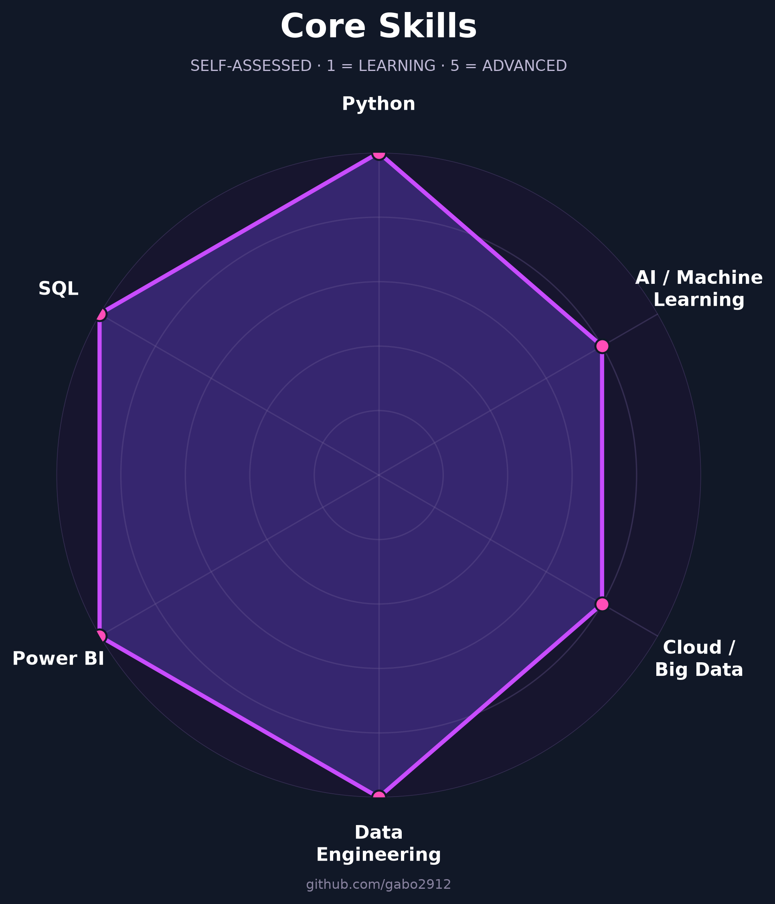

<div align="center">

# Gabriel Zevallos

### Data Engineer · Data Analytics & BI · Artificial Intelligence

📍 Lima, Perú ·
[LinkedIn](https://www.linkedin.com/in/gabrielzevallos/) ·
[Email](mailto:gabriel.zevallos@pucp.edu.pe)

<br>


</div>

---

## About

Computer Engineering graduate from **Pontificia Universidad Católica del Perú (PUCP)**, ranked in the **top fifth** of the program and specialized in **Artificial Intelligence**.

I transform complex and unstructured information into actionable insights by building **data pipelines**, developing **business intelligence solutions**, and automating data-intensive processes.

My experience includes working with **Python, SQL, Power BI, Azure Databricks, Apache Spark and AWS**, with a strong focus on data quality, automation, cloud architectures and analytics.

Currently, I work in the banking sector developing data-driven solutions for reporting, risk analysis, automation and data integration.

```text
> Data Engineering · Analytics · Cloud · Artificial Intelligence
```

---

## Core Skills

<div align="center">



</div>

---

## Tech Stack

### Data Engineering


`ETL / ELT` ·
`Data Integration` ·
`Data Modeling` ·
`Data Quality` ·
`Lakehouse` ·
`Data Marts`

### Business Intelligence


`DAX` ·
`Power Query` ·
`Power Pivot` ·
`Dashboards` ·
`KPIs` ·
`Data Modeling`

### Databases


`Complex Queries` ·
`Window Functions` ·
`Views` ·
`PL/SQL` ·
`Query Optimization`

### Cloud & DevOps


`Azure Databricks` ·
`Apache Spark / PySpark` ·
`AWS EC2` ·
`AWS S3` ·
`AWS RDS`

### Artificial Intelligence


`Machine Learning` ·
`Deep Learning` ·
`NLP` ·
`LLMs` ·
`RAG` ·
`Embeddings` ·
`Prompt Engineering`

---

## Professional Experience

### 🏦 Banco de Crédito del Perú — BCP

**Risk Audit Intern · Wholesale Banking**  
`Jan 2025 — Present`

- Design and development of management dashboards using **Power BI, DAX and Power Query**.
- Development and operation of **ETL pipelines using Python and SQL Server**.
- Integration of heterogeneous data sources including internal systems, files and manually maintained sources.
- Migration of data workflows from local environments to **Azure Databricks and Apache Spark**.
- Implementation of automated data quality, consistency and integrity controls.
- Development and optimization of queries using **SQL Server and Oracle**.
- Automation of repetitive processes to reduce operational time and reprocessing.
- Coordination with business stakeholders to translate business requirements into technical solutions.

---

### 🎓 Pontificia Universidad Católica del Perú — PUCP

**Teaching Assistant · Faculty of Science and Engineering**  
`Apr 2026 — Present`

- Technical mentoring in programming, logic and algorithms.
- Laboratory correction and evaluation.
- Code review focused on programming best practices and efficiency.
- Support for students in understanding complex technical concepts.

---

## Featured Projects

### 🤖 Pishico — Generative AI Platform

End-to-end bilingual conversational platform developed as my thesis project.

```text
Documents
   ↓
Chunking
   ↓
Embeddings
   ↓
Vector Database
   ↓
RAG
   ↓
LLM
   ↓
REST API
```

**Stack**

`Python` ·
`FastAPI` ·
`LangChain` ·
`ChromaDB` ·
`PostgreSQL` ·
`Gemini API` ·
`Docker` ·
`AWS EC2` ·
`AWS RDS`

**Highlights**

- Built an end-to-end pipeline for unstructured data.
- Implemented embeddings and vector search.
- Designed a Retrieval-Augmented Generation architecture.
- Developed REST-based microservices.
- Deployed the platform on AWS.
- Conducted a field pilot and statistically evaluated the results.

---

### 💳 Automated Transaction Consolidation & Classification

End-to-end data pipeline that consolidates information from multiple data sources into a structured database.

**Stack**

`Python` ·
`pandas` ·
`scikit-learn` ·
`SQL` ·
`REST APIs`

**Highlights**

- Data ingestion from APIs and files.
- Cleaning and normalization.
- Hash-based deduplication.
- Automated transaction categorization.
- Hybrid classification using business rules and Machine Learning.

---

### 🚚 Large-Scale Logistics Simulation & Optimization

Backend system for simulating large-scale daily logistics operations and optimizing routes under complex constraints.

**Stack**

`Java` ·
`React` ·
`MySQL` ·
`Docker` ·
`AWS EC2` ·
`Linux`

---

### 📅 Club Reservation Platform

Web platform for managing space reservations while handling simultaneous requests and transactional integrity.

**Stack**

`Go` ·
`React` ·
`MySQL` ·
`Docker` ·
`AWS`

---

## Contribution Activity

<div align="center">

[](https://github.com/gabo2912)

</div>

---

## Education

### 🎓 Pontificia Universidad Católica del Perú

**B.Sc. in Computer Engineering**

`2021 — 2026`

- Top Fifth
- Artificial Intelligence concentration

---

## Certifications

- **Artificial Intelligence Concentration** — Pontificia Universidad Católica del Perú
- **SQL Base de Datos 2** — Universidad Nacional de Ingeniería
- **Automating Reports with Python** — Udemy
- **Advanced English** — Asociación Cultural Peruano Británica

---

## Languages

🇵🇪 **Spanish** — Native

🇬🇧 **English** — Advanced

---

## Currently Interested In

```text
Data Engineering
Cloud Data Platforms
Artificial Intelligence
Generative AI
Data Analytics
Process Automation
```

---

<div align="center">

## Let's Connect

[](https://www.linkedin.com/in/gabrielzevallos/)
[](mailto:gabriel.zevallos@pucp.edu.pe)

<br>

**Data Engineering · Analytics · Cloud · Artificial Intelligence**

</div>